# 4/06/2017 (Thursday) Blog Post II

### Previosuly...
In blog post I and midterm report, we briefly analyzed which words(tokens) were most influential/frequent in 5-star and 1-star ratings. We explored other factors such as relationship between weather (sunny / runny) and number of reviews. Since it rarely rained on Las Vegas, we decided to dive deeper into reviews and ratings (which has far more applications as well) to see whether reviews could acutally predict rating of a store.

### Process
1. After converting JSON data, we realized that each rating had different number of reviews.
2. In order to equally compare each rating, we first found a rating with least number. 2 was the least rated number with 358550. 
3. Then we got first 358550 ratings of each stars.
4. Using the TfidfVectorizer, we counted each word, and additionally we computed unigram & bigrams of words as well.
5. Got our input parameter for X, vectors = vectorizer.fit_transform(balanced_text)
6. Then using train_test_split, which automatically splits input data into train and test data, we divided Xtrain, Xtest, Ytrain, Ytest. (Here, we didn't attempt to do cross validation)
7. With above parameters, we trained linear SVM and predicted the test ratings.

### Results
In the first attempt, our accuracy was only 0.62361732769, which quickly disappointed us.
However, by looking at the confusion matrix, as seen below, we realized that accuracy was low because
there was little information to distinguish rating 1 from 2, and 4 from 5. Since the former would share negative comments, 
and latter the positive, it seemed reasonable that the classifier was having trouble distinguishing 1 from 2, and 4 from 5. 

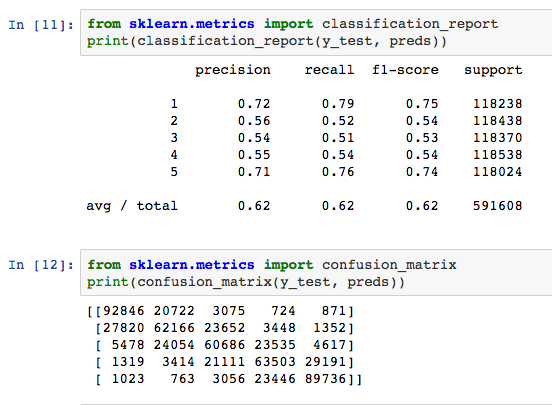

So, to boost up the accuracy, instead of predicting rating from 1 to 5, we generalized it into three categories:
positive, neutral, and negative. If the rating was 4 or 5, it was considered positive, 3 to be neutral, and 2 and 1 to be positive. Then, our accuracy went up to about 0.8, which isn't so bad. Now the confusion matrix seems far accurate as can be seen below. However, classifying neutral or "3" seems still hard as (1,2), (4,5) reviews have distinct features, while for "3", the features are often the negation of the features used in either positive or negative reviews such as "not bad" or "not good". Furthermore, it seems users have starkly different standards of "average," which can be an interesting detail to further probe (find out who's rating is inflated or deflated with each word).

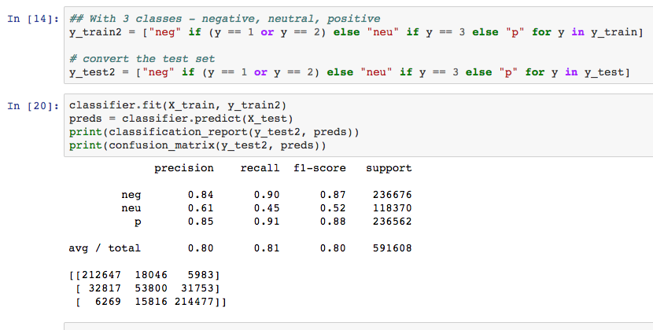

To go a step further, just like the ML lab, we printed out influential / counter features in each category. While nothing stands out, "be disappinted" as a positive feature in positive side is confusing us. It seems that the word "disappointed" is also categorized as positive as both "not disappointed" and "never disappointed" are rated highly positive.

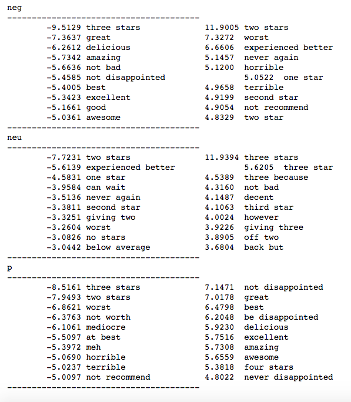

With additional measures likes stop words, cross-validation, tweaking of other parameters / classfiers, we hope to bring the accuracy rate of review predicting rating close to 0.9.

### Next Steps
Here are the things we want to tackle/query/ponder next.
- k-means clustering for location
- k-means clustering for users
- k-means clustering for review text
- what happens if we just cluster users?
- extract latent features
- k-means clustering of restaurants based on multiple features
- build a recommender system (recommendation based on text, based on similar restaurants…)

We are also trying to look into whether attributes, categories, and reviews can track ups and downs of a store, and ultimately predict whether it will close or grow bigger in the future. 
Here's a glimpse of our initial try, and it seems...we need a lot more work.

# 3/08/2017 (Wednesday) Blog Post I

### Data provided by Yelp
yelp_academic_dataset_business.json (size: 114.5 MB, records: 144,073)  
yelp_academic_dataset_checkin.json (size: 46.2 MB, records: 125,533)  
yelp_academic_dataset_review.json (size: 3.46 GB, records: 4,153,151)  
yelp_academic_dataset_tip.json (size: 182.2 MB, records: 946,601)  
yelp_academic_dataset_user.json (size: 1.18 GB, records: 1,029,433)  

### Overview

Due to large dataset, we decided to specifically focus on restaurants and parlors in Nevada, mostly in Las Vegas.
In order to get a clear picture of how the restaurants and stores were distribtued across Nevada, we ran several basic data explorations in various angles, toggling with zip codes, city, and county, map visualization, and word by word analysis of the reviews. 

### Data Exploration
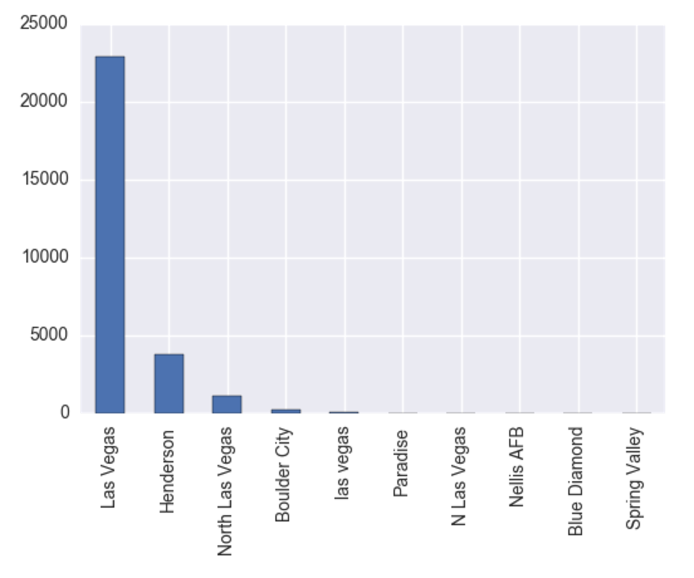

This bar graph intuitively shows that our data is mostly concentrated in greater Las Vegas area (more than 90%, including Henderson, North Las Vegas).

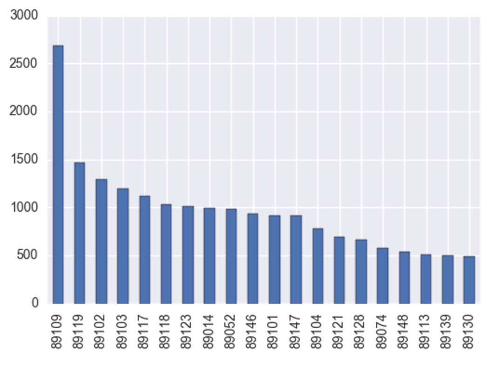

Next, we allocated stores by their zip codes, and as expected, even inside Las Vegas, we can see that
majority of them are located in Downton Las Vegas including the Strip area (89109, 89118, 89119). 

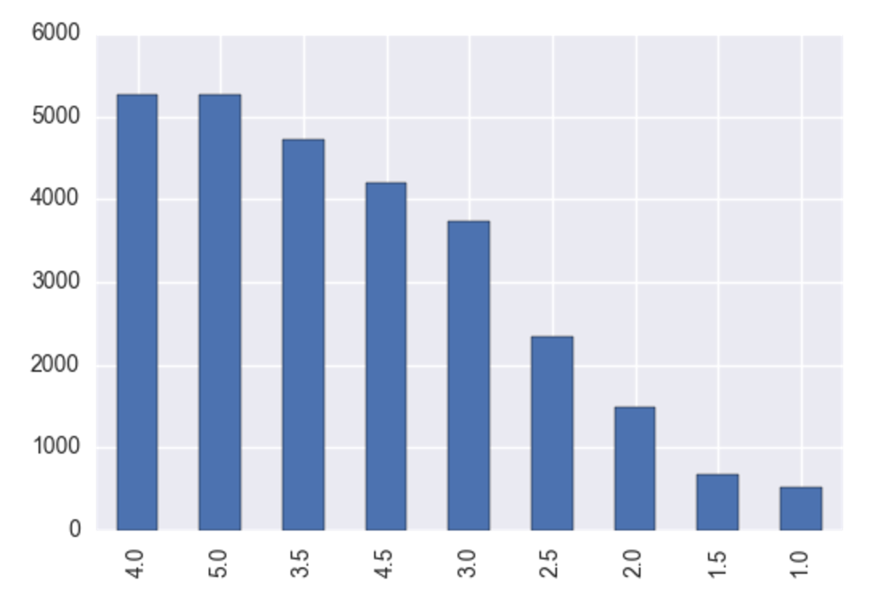

Here, we see a basic distribution of ratigs over the stores in Las Vegas region. The mean seems to be low 4, which indicates that most of the stores are viewed favorably and creates a cycle where already well-reviewed restaurants garner more reviews and higher ratings. While badly reviewd stores are shunned ans have fewer ratings. 

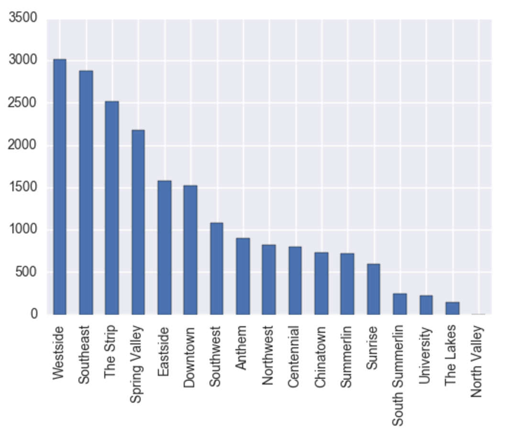

Here, we allocated the stores in terms of their county inside Las Vegas. 

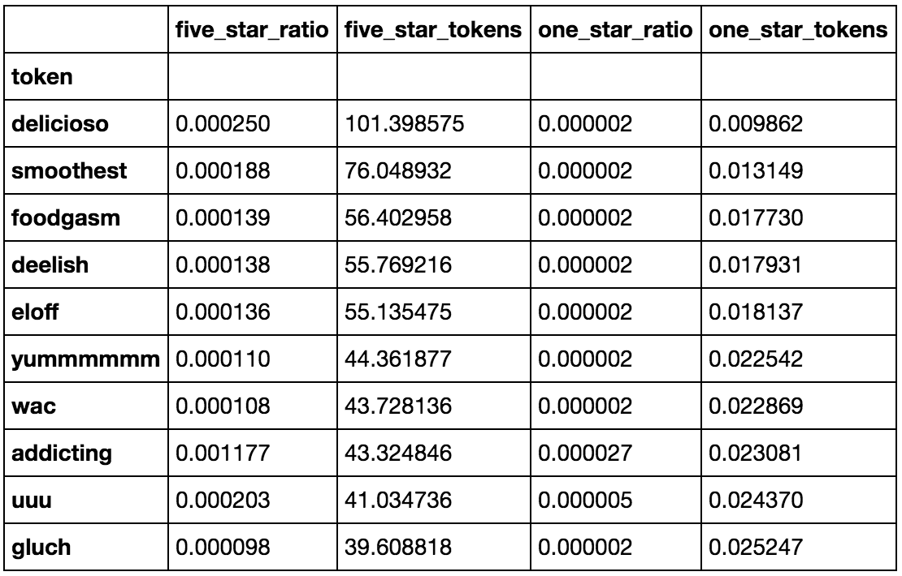

We wanted to find out which words are accounted the most for reviews with two extreme star values, 1 and 5.
For the text analysis, we used sklearn.feature_extraction.text.CountVectorizer to fit and transform text data into a matrix of token counts. By fitting the model using Multinomial Naive Bayes classifier, we were able to get two interesting results for each case.

Top 10 one-star tokens: 1) ontrac, 2) frechheit, 3) rudent, 4) discriminates, 5) unprofessionally, 6) telemarketing, 7) unprofessional, 8) insinuating, 9) discusting, 10) transcripts

Top 10 five-star tokens: 1) delivioso, 2) smoothest, 3) foodgasm, 4) deelish, 5) eloff, 6) yummmmmm, 7) wac, 8) addicting, 9) uuu, 10) gluch

### Map Visualization
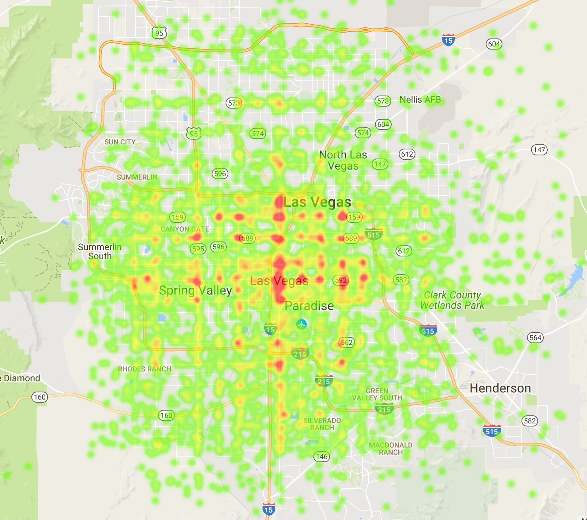
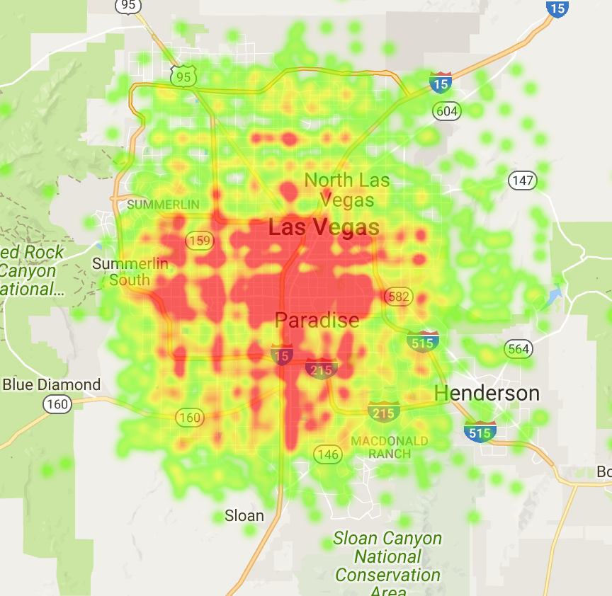
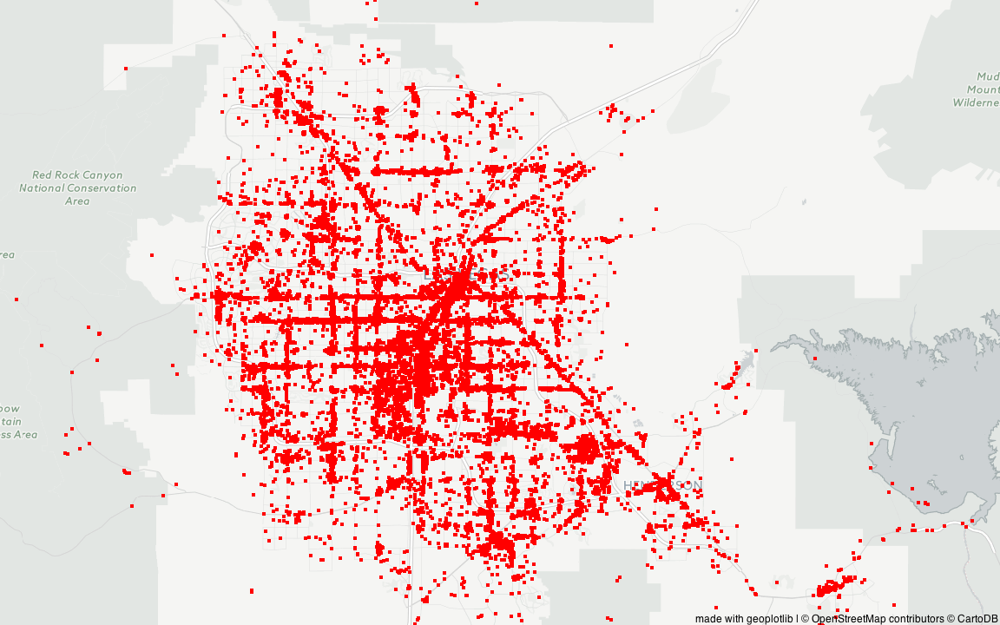
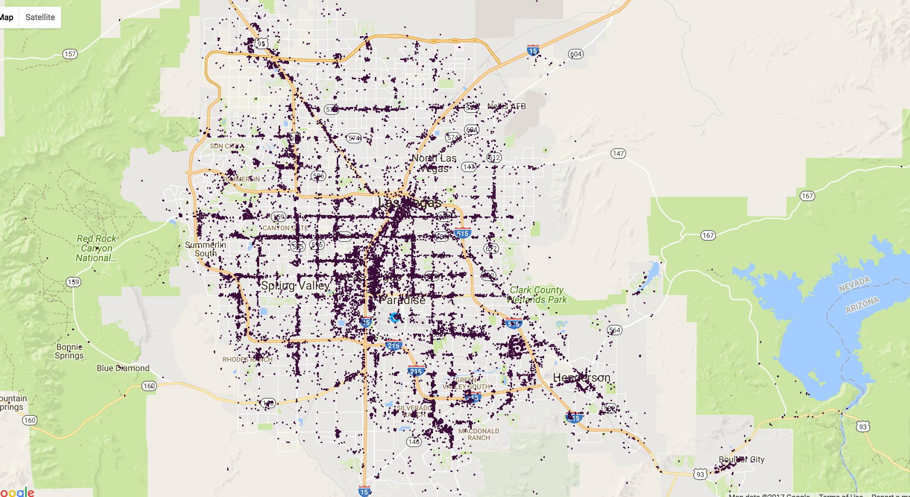

Libraries used: [gmplot](https://github.com/vgm64/gmplot), [geoplotlib](https://github.com/andrea-cuttone/geoplotlib)

In order to get a feel for where most of the data points (businesses) are located within the state of Nevada, we decided to plot the points on a map. There are two scatterplots and two heatmaps with varying zoom levels. As expected, we see that most of the datapoints within Nevada are in Las Vegas -- more specifically, the heatmap is more emphasized towards the The Strip (South Las Vegas Boulevard)

### Next Steps

We hope that by analyzing the review, we can spot the pattern of reviews and whether this can predict subsequent year's rating, review counts, and possibly whether that restaurant will prosper or close in the future. In the yelp data, there is no data which exactly show the sales or revenues of the restaurant, which can accurately represent the success of the business. So, we requested additional dataset about restaurant sales to CHD-experts. If we acquire data, we should find a way to combine and clean both datasets, and hope there are more patterns we can spot. In addition to that, we should finish up learning machine learning to find pattern and visualization on multiple parameters. Furthermore, we are trying to look into users, how each user influences subsequent reviews, who the power-reviewer is, and how they rate stores. 
