# 4/25/2017 (Wednesday) Blog Post IV
In this blog post, our focus was on running k-means clustering on reviews found in the Yelp Dataset. In order to work with a feasible set of data, we filter out permanently closed restaurants and those with < 100 reviews. We end up with 1625 restaurants in Nevada (mostly centered around Las Vegas) with a total of 635,149 reviews. In addition, we create a database with two tables - business and reviews. As is expected, the business table consists of business information pertaining to restaurants (address, location, business_id, etc) and reviews contains information such as user_id, business_id, stars, date etc. This will be helpful in our future work when we need to join different information (reviews & restaurants).

### Goal: K-means clustering to cluster documents
K-means clustering on text documents is often a challenging process due to the high dimensionality of documents. We will be attempting to cluster reviews based on k-means clustering and generate visualizations through the use of various libraries: scikit-learn, pandas, NLTK, matplotlib and more.

### Amazon AWS EC2
Since it is difficult to run intensive computations on our local machines (memory isn't sufficient), we end up using an EC2 Instance on Amazon's AWS. We use a m3.2xlarge instance, which has ~30 GB RAM (+20GB allocated SSD), which turned out to be enough for our computations.

### First attempt
We retrieve our data from the database and convert it to a list containing all of our reviews
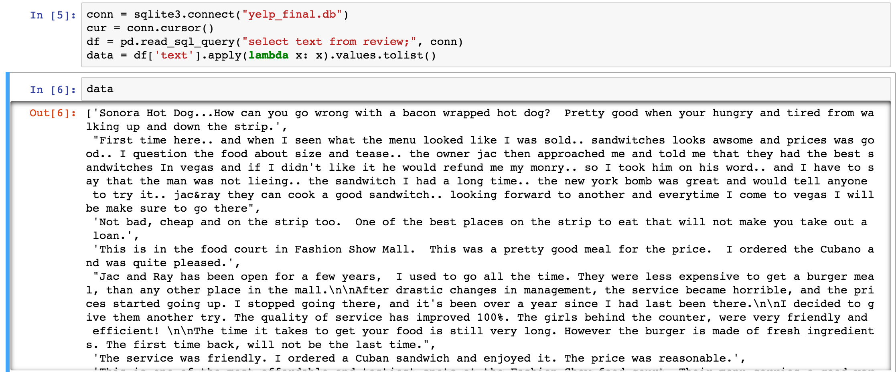

We need to extract features from the dataset: we use scikit-learn's TFIDFVectorizer, which will output a sparse matrix. We use the default values for most and some custom values (max_df = 1.0, min_df = 0.0, max_features = 100,000, use_idf = false)

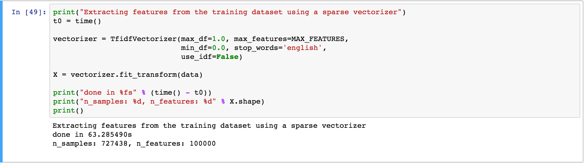

The # of features for each vector is > 100,000, but it is cut off at the limit (max_features). Next, we run MiniBatchKMeans clustering on the vectors (minibatch is much more computationally efficient for large datasets and only minimally less optimal) and generate the top terms per cluster (we use the k-means++ algorithm for centroid initialization, which will give us significantly better initial cluster centers relative to random generation -- thus there is a lower probability that the k-means algorithm will get stuck at a less than optimal local minima):

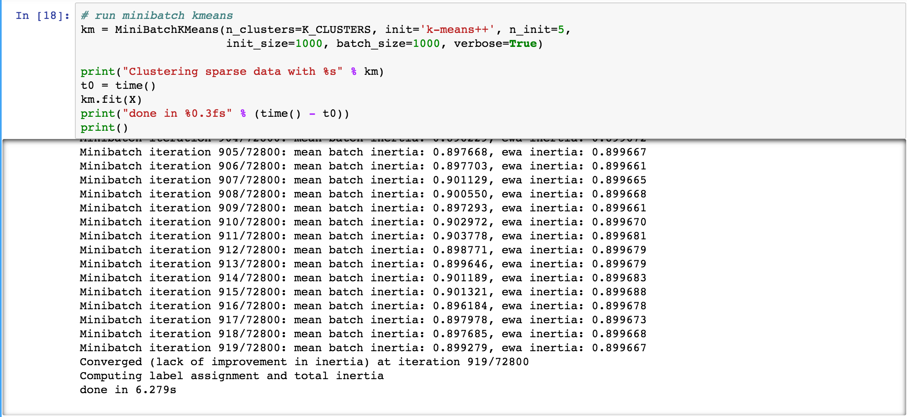
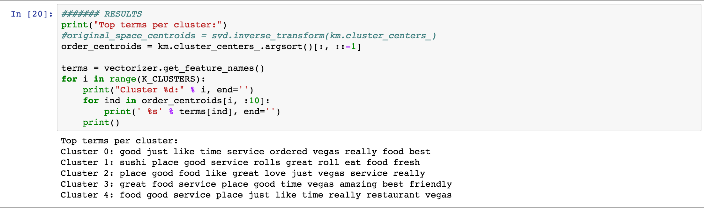

The clustering converges after 919 iterations. Examining the top terms per cluster, we see that the clustering did a pretty awful job - common words such as food, place, restaurant are littered throughout the top terms.

### Several attempts later
After playing around with various parameters, we make several revisions:
First, when we use the TFIDFVectorizer, we set max_df = 0.7 and min_df = 100 (all terms with document frequency > 0.7 will be excluded -- that is, all terms that are in more than 70% of the documents will not be in the feature set -- and all terms that are in less than 100 documents will be excluded as well. We also set use_idf to True to enable inverse-document-frequency weighting in order to get features that are considered to be more important throughout the entire corpus. 

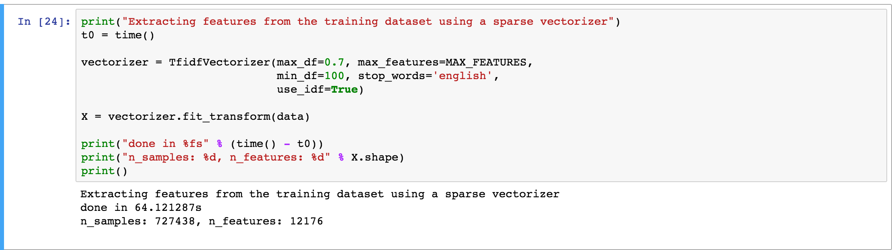

The result is that we get a significantly less amount of features. However, 12,176 is still an extremely large feature set to work with in k-means clustering, thus we use LSA to reduce dimensionality:

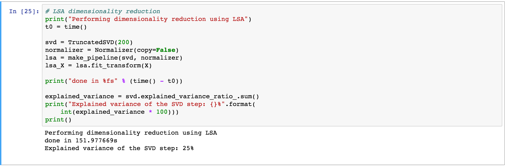

We set the parameter so that the algorithm will reduce the feature set to 200 features; this seems to output a feature set that explains 25% of the variance (100 features will explain ~15% of the variance). Next, we run the MiniBatchKMeans again on this feature set (here, we use K = 15 and init_size = 3000):

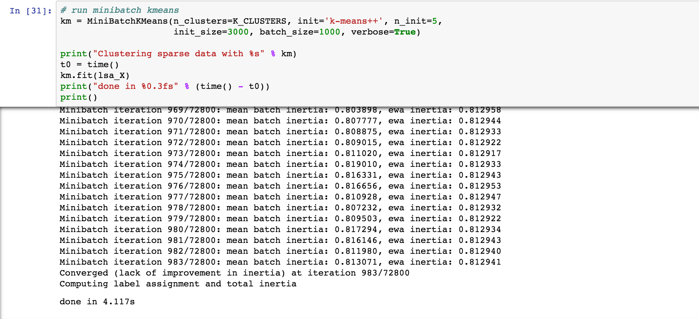
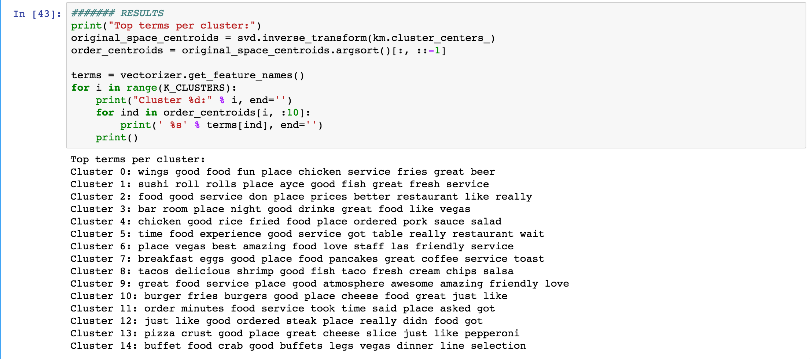

It seems as if the algorithm is doing a much better job at creating clusters now. After multiple rounds of tweaking, the most influential ones seem to be: using IDF to determine weights, using feasible max_df, min_df cutoffs, and using LSA to reduce the dimensions. Briefly glancing over the top terms per cluster, we can observe the following:
- Cluster 0 - chicken wings, fries, beer, fun => beer & fun
- Cluster 1 - sushi rolls fish => japanese 
- Cluster 7 - breakfast, eggs, pancakes, coffee => breakfast
- Cluster 8 - tacos, shrimp, salsa, chips => Mexican
- Some other ones include burger & fries, good atmosphere, pizza & cheese, buffet & crab, etc

On the otherhand, some of the clusters still seem to be too generic: e.g. Cluster 5 (time food experience good service got table really restaurant wait). Perhaps we need more tweaking of the cutoff parameters and the number of clusters.

### Brief visualization
Since we want to see if the clusters make sense visually, we attempt to draw some plots with matplotlib. Since it is extremely challenging to efficiently (visually) plot high-dimensional clusters, we use LSA to create a 2-d (voronoi-like) plot:

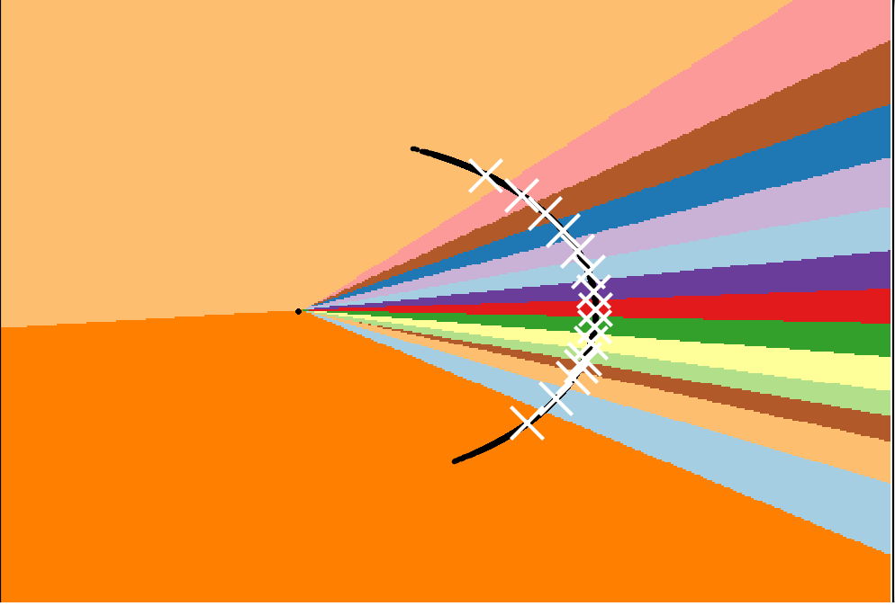

The results, as interesting as they may be, don't seem to be good. The clusters keep breaking up and there are two enormous clusters - we can probably predict that as we increase the number of clusters, the slices of small clusters will increase correspondingly beginning on the right-hand side

Apparently not. It seems as if the clusters on the right do follow our hypothesis, but the clusters on the left begin to break up as well. The problem is that with this visualization and with our use of LSA, it's really hard to figure out what is happening. When we actually run our k-means clustering, we use 200 feautures - however, the plot is only using 2 features. As a result, what is happening in the plots may not line up with what actually happened in our clustering results.

### Next steps
1) Figure out a way to measure error (apart from inertia). Can we come up with a metric for error in this clustering?
2) Figure out a better K - this may be difficult due to high dimensionality, but we plan to use silhoutte analysis (http://scikit-learn.org/stable/auto_examples/cluster/plot_kmeans_silhouette_analysis.html)
3) Try out various things to improve the algorithm:
  - LDA, MDS (multidimensional scaling) for dimension reduction - we can try to use MDS as another way to plot the clusters on a 2d graph by converting the distance matrix to a 2d matrix
  - Preprocessing: more stopwords, stemming, tokenizing, n-grams: we will see if these methods will increase the quality of clustering
4) Visualizations: can we more efficiently plot the clusters so that we can more easily visually analyze our clusters?

After we finalize our clustering for reviews, we can do the following:
1) Cluster restaurants based on these review clustering
2) Cluster users based on these reviews, then use the resulting user clusters to cluster restaurants
3) Different clustering methods (hierarchical)
4) Recommendations 
  - given free form text, can we vectorize it and assign it a cluster to provide recommendations?
  - recommendations using restaurant clustering in 1) and 2)

# 4/12/2017 (Wednesday) Blog Post III

### Previously...
In blog post II, we classified the reviews into three groups--positive, neutral, and negative-- and explored influential and counter features in each group. As we have said in previous post, we did clustering based on reviews, so that we can use the data for our recommendation system. 

### LDA
Latent Dirichlet allocation (LDA) is a topic modeling technique of discovering topics in a text corpus. 

### Purpose
It is often very annoying to deal with a large number of reviews especially when they are long and dense. It would be much more convenient for the readers to access the reviews if they were previously classified into different categories of users’ interests. Potential customers who are interested in reading reviews about ‘customer service’ or ‘healthy food’ can simply refine their search by the topic of their interests. Moreover, we can use this trained model to automate the process of predicting the topic of new reviews. 

### Process
1. Sample 10,000 out of 4,153,150 review texts since training LDA model takes long time.
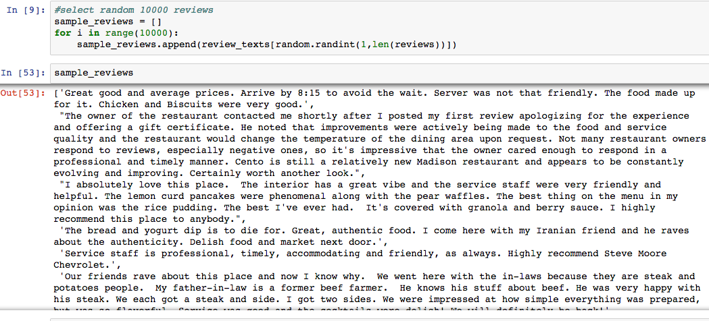
2. Clean the sampled review texts by lower casing all characters, removing stopping words(get_stop_words) and merging words that essentially have the same meaning (PorterStemmer).
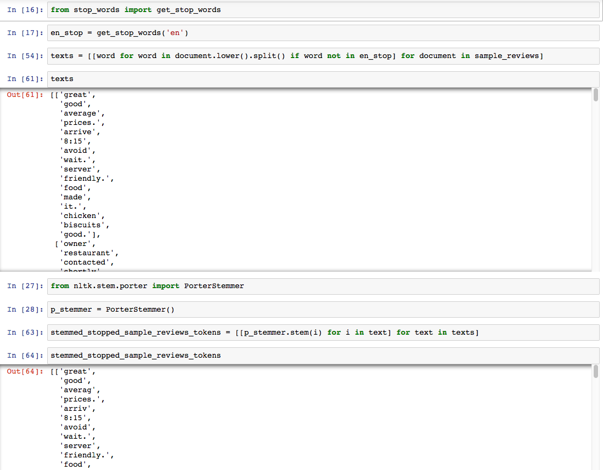
3. Construct a document-term matrix that shows the frequency of words in each review text.
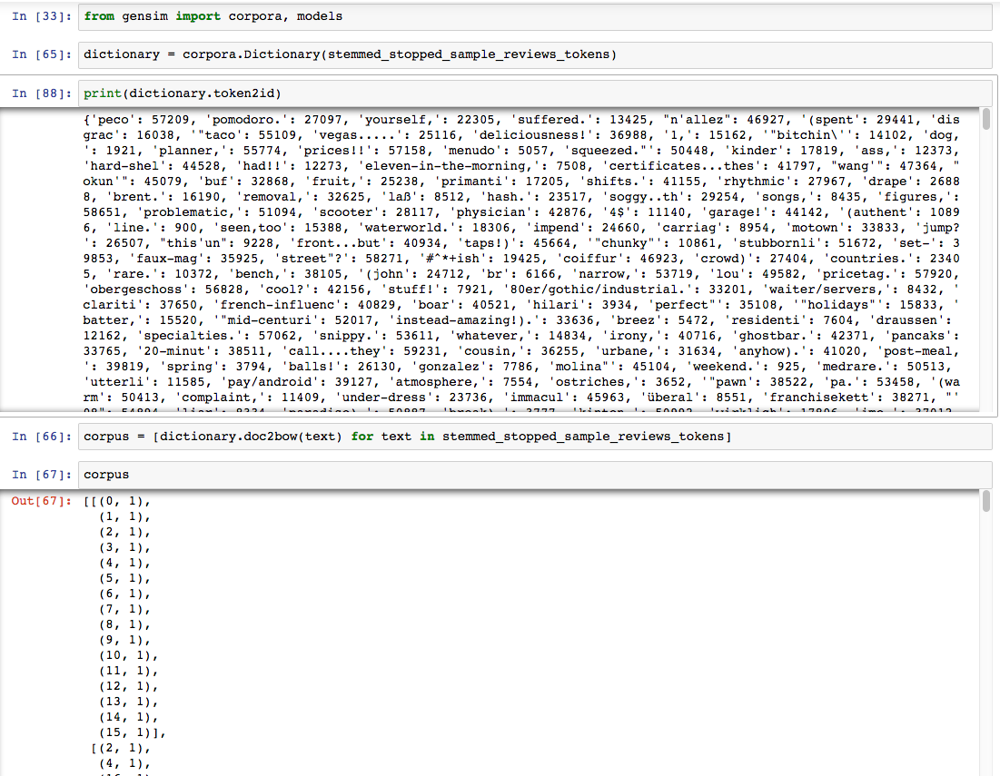
4. Train three LDA models with different parameter values (number of topics).
5. Print out the topics and check the result of each model. 	

### Results
N (number of topics)  = 10 
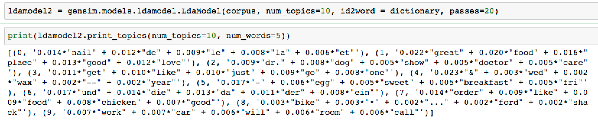
I would assign 'chicken restaurant' topic to (7, '0.014*"order" + 0.009*"like" + 0.009*"food" + 0.008*"chicken" + 0.007*"good"').

N  = 20 
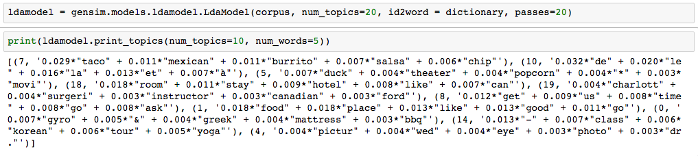
I would assign 'accomodation' topic to (18, '0.018*"room" + 0.011*"stay" + 0.009*"hotel" + 0.008*"like" + 0.007*"can"').

N  = 30 
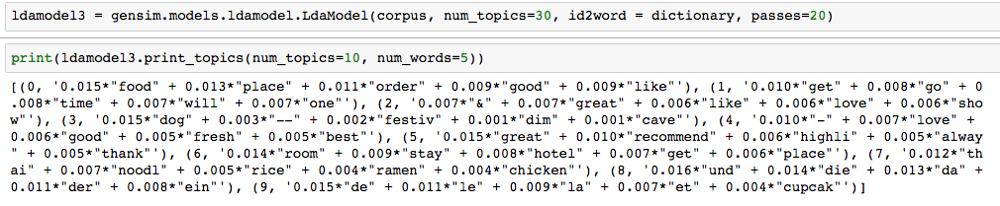
I would assign 'thai restaurant' topic to (7, '0.012*"thai" + 0.007*"noodl" + 0.005*"rice" + 0.004*"ramen" + 0.004*"chicken"').

### Next Steps
- Assigning all the reviews to their corresponding clusters (topics) and evaluating the accuracy of our models. 
- More feature engineering on raw review texts to increase the accuracy.
- Further Clustering with users based on their ratings
- Web app: Build a recommendation system (recommendation based on free-form text or user selection)

# 4/06/2017 (Thursday) Blog Post II

### Previously...
In blog post I and midterm report, we briefly analyzed which words (tokens) were most influential in 5-star and 1-star ratings. We explored other factors such as relationship between the weather (sunny / runny) and the number of reviews. Since it rarely rained in Las Vegas, we decided to dive deeper into reviews and ratings: can we use a classifier to predict ratings from reviews?

### Process
1. After converting JSON data, we realized that each rating had different number of reviews.
2. In order to equally compare each rating, we first found a rating with least number. 2 was the least rated number with 358550. 
3. Then we got first 358550 ratings of each stars.
4. Using the TfidfVectorizer, we counted each word, and additionally we computed unigram & bigrams of words as well.
5. Got our input parameter for X, vectors = vectorizer.fit_transform(balanced_text)
6. Then using train_test_split, which automatically splits input data into train and test data, we divided Xtrain, Xtest, Ytrain, Ytest. (Here, we didn't attempt to do cross validation)
7. With above parameters, we trained linear SVM and predicted the test ratings.

### Results
In the first attempt, our accuracy was only 0.62361732769, which wasn't awful (20% random guessing for 5 classes).
However, by looking at the confusion matrix, as seen below, we realized that accuracy was low because
there was little information to distinguish rating 1 from 2, and 4 from 5. Since the former would share negative comments, 
and latter the positive, it seemed reasonable that the classifier was having trouble distinguishing between 1 and 2 ratings and between 4 and 5 ratings. 

So, to boost up the accuracy, instead of predicting rating from 1 to 5, we generalized it into three categories:
positive, neutral, and negative. If the rating was 4 or 5, it was considered positive, 3 to be neutral, and 2 and 1 to be positive. The result: our accuracy went up to ~0.8. However, classifying as neutral or "3" still seems hard - while (1,2), (4,5) reviews have distinct features, (3) star ratings seem to be harder to distinguish. Furthermore, it seems users have starkly different standards of "average," which can be an interesting detail to further probe (find out who's rating is inflated or deflated with each word).

To go a step further, just like the ML lab, we printed out influential / counter features in each category. While nothing stands out, "be disappinted" as a positive feature in positive side is confusing us. It seems that the word "disappointed" is also categorized as positive as both "not disappointed" and "never disappointed" are rated highly positive.

With additional measures likes stop words, cross-validation, tweaking of other parameters / classfiers, we hope to bring the accuracy rate of review predicting rating close to 0.9.

Finally, we attempted to look into whether we could predict whether the restaurant was open or closed (permanently) based on review text. Here are the most important features (~ 65% precision value) that contribute to the classification:

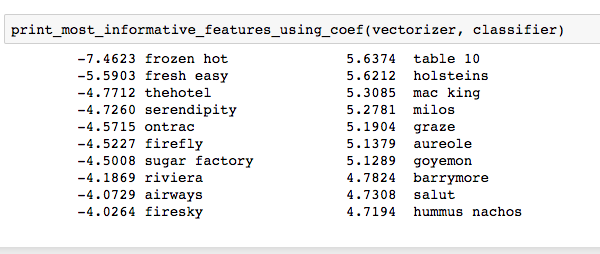
There seems to be no obvious pattern here; we need more work.

### Why?
Because all reviews on Yelp are accompanied by ratings, it's plausible to ask why we used a classifer to predict ratings from reviews:
1) Further data exploration - we observed what features are important for classifying each review as negative / positive / neutral. Since we might attempt to extract latent features (LDA) later on, this might be helpful.

2) Analyzing sentiment on other websites: if the restaurant / business has its own website with reviews (but no ratings), this classifer could give a rough estimate of the overall rating from that website.

3) Building a recommendation engine: the work we did in this post could be helpful in developing a recommendation engine (which might be our end goal). For example, we might attempt to cluster restaurants based on review text (as one feature).

### Next Steps
Here are the things we want to tackle/query/ponder next.
- k-means clustering on location (lat, lng)
- k-means clustering on users
- k-means clustering on review text (worth considering how to represent restaurants as one vector, given n review vectors)
- Clustering users (can we find patterns? social groups?0
- extract latent features from review text
- After exploring the above: k-means clustering of restaurants based on multiple features
- Web app: Build a recommendation system (recommendation based on text, based on similar restaurants, etc)

# 3/08/2017 (Wednesday) Blog Post I

### Data provided by Yelp
yelp_academic_dataset_business.json (size: 114.5 MB, records: 144,073)  
yelp_academic_dataset_checkin.json (size: 46.2 MB, records: 125,533)  
yelp_academic_dataset_review.json (size: 3.46 GB, records: 4,153,151)  
yelp_academic_dataset_tip.json (size: 182.2 MB, records: 946,601)  
yelp_academic_dataset_user.json (size: 1.18 GB, records: 1,029,433)  

### Overview

Due to large dataset, we decided to specifically focus on restaurants and parlors in Nevada, mostly in Las Vegas.
In order to get a clear picture of how the restaurants and stores were distribtued across Nevada, we ran several basic data explorations in various angles, toggling with zip codes, city, and county, map visualization, and word by word analysis of the reviews. 

### Data Exploration

This bar graph intuitively shows that our data is mostly concentrated in greater Las Vegas area (more than 90%, including Henderson, North Las Vegas).

Next, we allocated stores by their zip codes, and as expected, even inside Las Vegas, we can see that
majority of them are located in Downton Las Vegas including the Strip area (89109, 89118, 89119). 

Here, we see a basic distribution of ratigs over the stores in Las Vegas region. The mean seems to be low 4, which indicates that most of the stores are viewed favorably and creates a cycle where already well-reviewed restaurants garner more reviews and higher ratings. While badly reviewd stores are shunned ans have fewer ratings. 

Here, we allocated the stores in terms of their county inside Las Vegas. 

We wanted to find out which words are accounted the most for reviews with two extreme star values, 1 and 5.
For the text analysis, we used sklearn.feature_extraction.text.CountVectorizer to fit and transform text data into a matrix of token counts. By fitting the model using Multinomial Naive Bayes classifier, we were able to get two interesting results for each case.

Top 10 one-star tokens: 1) ontrac, 2) frechheit, 3) rudent, 4) discriminates, 5) unprofessionally, 6) telemarketing, 7) unprofessional, 8) insinuating, 9) discusting, 10) transcripts

Top 10 five-star tokens: 1) delivioso, 2) smoothest, 3) foodgasm, 4) deelish, 5) eloff, 6) yummmmmm, 7) wac, 8) addicting, 9) uuu, 10) gluch

### Map Visualization

Libraries used: [gmplot](https://github.com/vgm64/gmplot), [geoplotlib](https://github.com/andrea-cuttone/geoplotlib)

In order to get a feel for where most of the data points (businesses) are located within the state of Nevada, we decided to plot the points on a map. There are two scatterplots and two heatmaps with varying zoom levels. As expected, we see that most of the datapoints within Nevada are in Las Vegas -- more specifically, the heatmap is more emphasized towards the The Strip (South Las Vegas Boulevard)

### Next Steps

We hope that by analyzing the review, we can spot the pattern of reviews and whether this can predict subsequent year's rating, review counts, and possibly whether that restaurant will prosper or close in the future. In the yelp data, there is no data which exactly show the sales or revenues of the restaurant, which can accurately represent the success of the business. So, we requested additional dataset about restaurant sales to CHD-experts. If we acquire data, we should find a way to combine and clean both datasets, and hope there are more patterns we can spot. In addition to that, we should finish up learning machine learning to find pattern and visualization on multiple parameters. Furthermore, we are trying to look into users, how each user influences subsequent reviews, who the power-reviewer is, and how they rate stores. 
